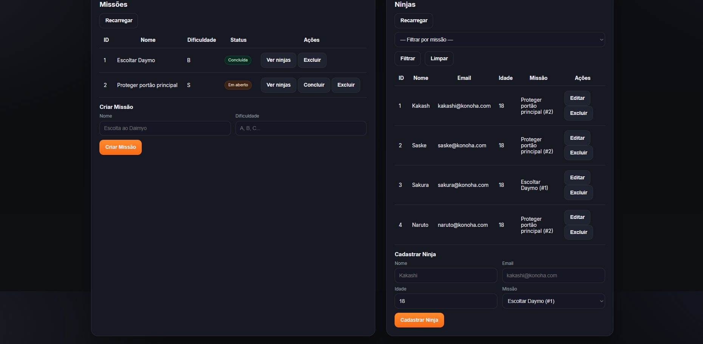

# 🥷 Cadastro de Ninjas — Guilda da Aldeia

Projeto desenvolvido em **Java 21 + Spring Boot 3** com um front-end simples em **HTML + CSS + JS**.

## 🚀 Funcionalidades
- Cadastro de Missões (CRUD)
- Cadastro de Ninjas (CRUD)
- Associação Ninja ↔ Missão (1 ninja participa de 1 missão, 1 missão pode ter vários ninjas)
- Marcar missões como concluídas
- Interface web temática estilo "guilda" para gerenciamento

## 🛠️ Tecnologias
- Java 21
- Spring Boot 3 (Web, JPA, Validation)
- H2 Database (memória)
- Lombok
- HTML + CSS + Vanilla JS (frontend)

## 📸 Demonstração


## ▶️ Como executar

```bash
# Clonar o projeto
git clone https://github.com/seu-usuario/cadastro-de-ninjas.git
cd cadastro-de-ninjas

# Rodar a aplicação
./mvnw spring-boot:run
